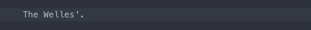
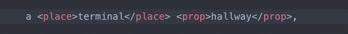
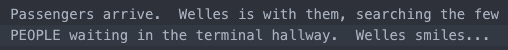

# Filmustage script markdown
[](https://www.codacy.com/app/filmustage/filmustage_script_markdown?utm_source=github.com&amp;utm_medium=referral&amp;utm_content=filmustage/filmustage_script_markdown&amp;utm_campaign=Badge_Grade)


Team datasets guidelines in [Notion](https://www.notion.so/filmustage/Datasets-Guidelines-5445b5559c8948d59e30b44b531f0dc4).

## 1. Install package
Install from the app:
- In Atom, open Preferences (Settings on Windows).
- Go to Install section.
- Search for `filmustage-script-markdown` package.<br>
Once it found, click Install button to install package.

Install from the site:

Install `filmustage-script-markdown` from Atom package page:<br>
[https://atom.io/packages/filmustage-script-markdown](https://atom.io/packages/filmustage-script-markdown)

## 2. Use tags

After you've done that you should be able to use the `hotkeys` for adding tags.

Select text and press:

Tag | Key | Default color
------- | ------ | ------
`<place></place>` | <kbd>F1</kbd> |  <span style="color:#d23e24">#d23e24</span>
`<location></location>` | <kbd>F2</kbd> |  <span style="color:#7b7aff">#7b7aff</span>
`<time></time>` | <kbd>F3</kbd> |  <span style="color:#d936db">#d936db</span>
`<prop></prop>` | <kbd>F4</kbd> |  <span style="color:#00a36c">#00a36c</span>
`<actor></actor>` | <kbd>F5</kbd> |  <span style="color:#c8c817">#c8c817</span>
`<actor_add></location>` | <kbd>F6</kbd> |  <span style="color:#f6f4ac">#f6f4ac</span>
`<location_add></location_add>` | <kbd>F7</kbd> |  <span style="color:#0096ff">#0096ff</span>
`<extras></extras>` | <kbd>F8</kbd> |  <span style="color:#e98604">#e98604</span>
`<animal></animal>` | <kbd>F9</kbd> |  <span style="color:#bb0da5">#bb0da5</span>
`Delete tags around` | <kbd>ALT</kbd> + <kbd>F1</kbd> |

If you want to delete or change tags, `<>select text with tags</>` and press:
- <kbd>ALT</kbd> + <kbd>F1</kbd> for `delete tags around`
- Any **hotkeys** from top for `replace tags around`

## 3. Extra features

- If you mark selected text with wrong tag, you can simple change it by pressing another hotkeys.
- If you mark selected text with articles (a, an, the), spaces, dots, commas, etc, they automatically pushed out of tags:<br>

- If you need to change multiple tags or remove they, just select text with tags and press hotkeys:<br>

- Auto expand selection on whole word: <br>


## 4. Settings
Open `Atom Settings`, go to `Packages` in the left hand sidebar, and press `Settings` on `filmustage-script-markdown` to open the list of settings available for the Filmustage package.

- You can disable color tags highlights.
- You can change default tag action for hotkey and color of highlight.
- In bottom of settings section you can find `JSON` code for Atom [touchbar](https://atom.io/packages/touchbar) package.

## 5. Change Hotkeys

You can override these keybindings by copying and pasting this code into your `keymap.cson` file in `Preferences > Keybindings` and modifying it:
```CSON
  'atom-text-editor':
    'f1': 'filmustage:tag-f1'
    'f2': 'filmustage:tag-f2'
    'f3': 'filmustage:tag-f3'
    'f4': 'filmustage:tag-f4'
    'f5': 'filmustage:tag-f5'
    'f6': 'filmustage:tag-f6'
    'f7': 'filmustage:tag-f7'
    'f8': 'filmustage:tag-f8'
    'f9': 'filmustage:tag-f9'   
    'alt-f1': 'filmustage:tag-f10'
```

## Tags colors
Costum markdown tags colors based on [atom-color-the-tag-name](https://github.com/jzmstrjp/atom-color-the-tag-name) package.
